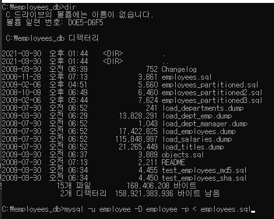
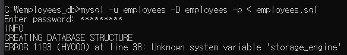
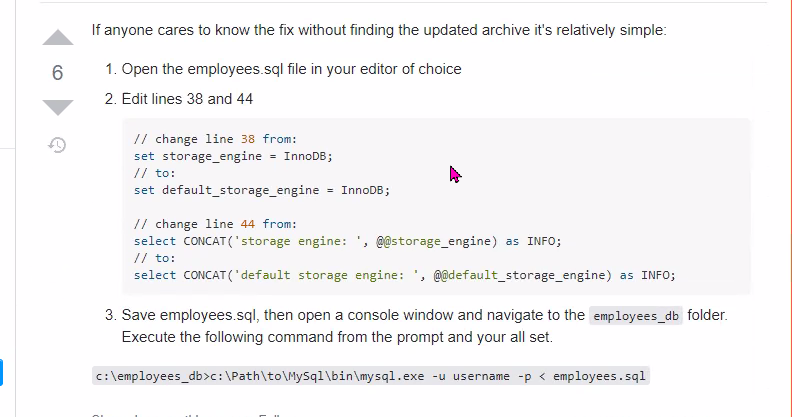
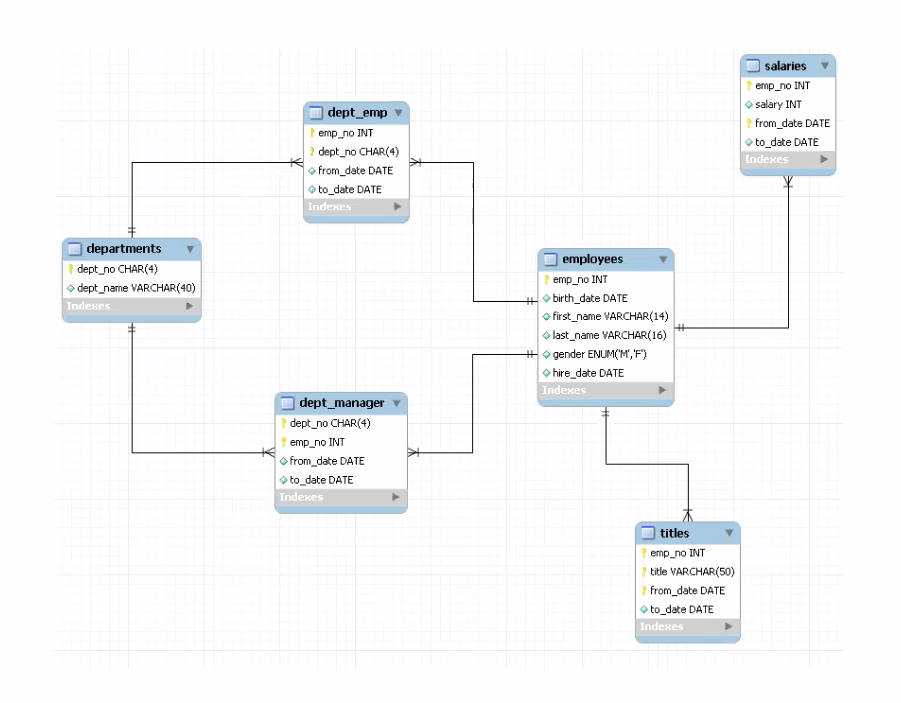

SQL  
 DDL  
 DCL   
 DML   
    select:기본 * 'select' 'from' 'where' 'order by' 이렇게 4개  
           집계 ***  
           join *****  
           서브쿼리 ***  
    insert
    update
    delete

검색 연습을 많이 해야함

# cmd에서 mysql 들어갈 때
mysql -u root -p  
manager 입력

# employee db 설치

1. DB 및 계정 생성 (workbench에서 DBA로 접속)
- create database employees;  
   데베 만듬, 데베 이름이 employees
- create user 'employees'@'localhost' identified by 'employees';  
   유저 이름 employees로 생성, 비밀번호도 employees로 설정
- grant all privileges on employees.* to 'employees'@'localhost';  
   데베 employees의 모든 권한을 employees 계정에 줌
- flush privileges;  
   얜 필기한거 ㅊ찾아보면 있을듯
   
2. 접속 테스트
- Workbench에서 employees 계정으로 employees DB 접속

3. DB 인스톨

- c:\employees_db> mysql -u employee -D employees -p < employees.sql  
employee.sql 에 있는게 한줄씩 싹 들어가게 됨  
- -D 뒤에는 데이터베이스 이름이 들어옴  
- '<' 이건 파이프. 입력임  
- '>' 이렇게 하면 출력  
  
이런식으로 했음

- 오류가 발생함 
  
  
- 그래서 
  
  이렇게 변경해서 됐다.
  
# 수업 

## 14:00 ~ 14:50

employees db 의 ERD

- salaries 에서 emp_no 랑 from_date 두개를 함께 세트로 주키로 사용  
employees 테이블과 salaries 테이블은 일대다

- titles 에서는 emp_no 와 title, from_data 3개를 함께 세트로 주키가 됨  

## 15:00 ~ 15:50

select  
from  
where  
order by  

from where orderby 순서대로 실행된다고 보면 되는데  
from 의 테이블에서 where 의 조건에 따라 임시테이블에 놓고 orderby로 소트하고
select로 해당 사항을 출력

이걸 대충 projection? 이라고 함

- 집계는 어떻게 하는 것이냐?  
order by 는 무조건 맨 마지막  
  