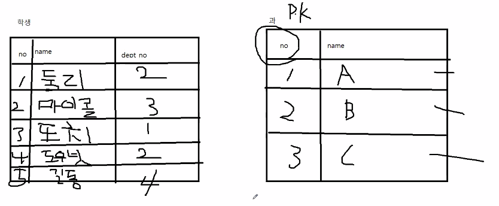
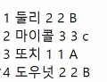
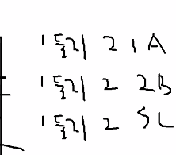

# 2021/03/31 WED

DCL 
DML
>insert 
> update 
> delete 
>select #아래는 select의 하위
> >기본 
> >집계 
> >조인 
> >서브쿼리 

DDL
>SELECT  
>FROM 
>WHERE 
> ORDER BY 
> 
적용 순서 

    FROM 으로 테이블
    WHERE 로 조건 걸고
    SELECT의 avr 때문에 임시 테이블이 생성 (avr를 수행)
    만약 => SELECT avr(a),no 이렇게 두개를 셀렉하면
    오류가 나는게 맞음 => *집계 함수*가 오면 다른 컬럼은 올 수 없다.

- GROUP BY  
  WHERE 다음에 붙음, 그룹별로 계산을 한다  
  WHERE로 만들어진 임시 테이블에서 GROUP BY 실행  
  ex) g => a a b c , a => 10 100 15 10 가 있을 때  
  GROUP BY g 하면,  
  g의 각각 그룹에 따른 평균을 내줌 그리고 이걸  
  SELECT g, avg(a) 이게 가능  
  g => a b c , avg(a) => 55, 15, 10 이케 됨.
  

- HAVING  
  WHERE 로 조건을 한번 건 후, 그걸로 다시 조건을 걸고 싶다면  
  HAVING을 통해 조건을 걸 수 있음.  
  WHERE는 한번 지났으면 다시 돌아가지 못함

- JOIN

        INNER JOIN : EQUIJOIN, NATURAL JOIN, Join~using, 표준 join 문법
            EQUIJOIN 은 INNER JOIN의 종류 중 하나
                **참고1**
                학생 테이블에서 dept_no 에 2가 들어가면 과 테이블의 no에서 2와 매칭되어
                B가 들어감. 2가 B를 레퍼런스로 먹어버림
                그럼 이제 마이콜의 dept_no 가 3이니까 C 인게 되는거임
                dept_no 가 학생 테이블의 forien key, 과 테이블의 no가 primary key
                이렇게 같은 속성을 갖고 있는(dept_no 와 no) 두 테이블을 가지고 조인을 시킴.

                select *
                    from student, dept
                    where student.dept_no = dept.no
            이걸 돌리게 되면 **참고2** 처럼 결과가 나옴.
            조건을 만족하는 애들만 나오는게 INNER JOIN
            
        OUTER JOIN 
            얘는 조건을 만족하지 않아도 다 나옴.

**참고1** 
 
**참고2**

만약, 두 테이블이 연관이 없다고 한다면

이런 식으로 학생 테이블에 하나당 과 테이블에 있는 3개가 먹으니까
3*5 개의 테이블이 나옴 

## ERD 그리기
WORKBENCH 홈에서 두번째 탭 하면 ERD 툴이 나옴

ERD => DB 하는 과정을 forward engineering
ERD <= DB 하는 과정을 reverse engineering
workbench에서 erd 그리고 그걸 바꾸는거 가능
그 설정할 때 맨 위, 맨 밑꺼랑 그 위에꺼 이렇게 3개 누르고 함

식별 비식별?
테이블의 주키가 따로 있고 포린키로만 존재하면 비식별?
나중에 다시 볼게요