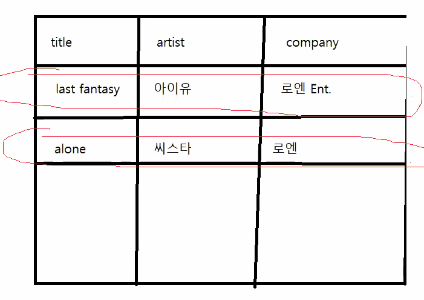

# 210401

- 추상화  
  공통된 것을 모아두는 것을 '추상화' 라고 함  
  필요한 데이터만 남겨놓고 나머지 쓸 데 없는 데이터들은 버리는 것  
  각각 db마다 필요한 데이터가 다르기 때문에  
  이런 비즈니스 구조나 관계에 따라 도메인이 다를 수 있음  
  

- 데이터베이스 설계의 목적  
  정규화를 통해 중복성 제거, 무결성 확보  
  각 컬럼이 들어갈 때 중복된 것들이 들어가는 건 안됨  

  
- 데이터 모델  
  db 설계를 도식화한 도표  
  엔티티, 속성(attribute), 관계(relation) 3가지로 구성  
  - 릴레이션 => 일대다 일대일 다대다 이런거 
  - 엔티티 => 데이터가 저장되어야 하는 객체, 
  엔티티에 대한 정보는 속성, 릴레이션으로 저장,
  엔티티들이 모이고 그걸 가로로 쭉 때려서 한 객체의 정보가 모두 저장되는 것을
  인스턴스라고 함 
  - 엔티티의 속성 => 엔티티의 정보, 뭐 varchar, int 이런게 될 수도 있고
  아니면 null, not null 이런 것들일 수도 있음  
  - 엔티티들이 물리적으로 만들어 지는 것을 테이블 
  
- 첫 번째 데이터 모델  
  엔티티 네이밍 규칙 => 엔티티 이름은 단수, 각 엔티티는 하나의 인스턴스
  

- 정규화 - 제 1 정규형 (1NF)  
  - 하나의 엔티티가 모든 속성들이 하나의 값을 가질 때,
  '제 1 정규형(1st Normal form)'  
  - **각 속성들은 엔티티의 각 인스턴스를 위한 하나의 값을 갖고 있는지 확인**  
  - 중복된 속성을 가진 엔티티는 그 안에 최소한 1개 이상의
  다른 엔티티가 존재한다는 의미  
  - ex) song에 비밀, 너랑나, 삼촌 이렇게 하나의 인스턴스에 때려 박는게 아니라
  비밀 // 너랑나 // 삼촌 이렇게 각각 다른 인스턴스에 넣어야 함  
  

- 두 번째 데이터 모델
  1NF 로 두개의 엔티티 생성  
  song이 album 테이블에 있었는데 그걸 따로 빼냄 (37~38 줄에서 설명)
  

- 유일한 식별자
  v
  v빨간 동그라미가 하나의 인스턴스, 이런 각각의 인스턴스를 구분할 수 있는 컬럼(식별자)이 필요.  
  v그건 이제 인스턴스를 따로 구분할 수 있기 때문에 그것을 primary key로 만든다.
  v이런 컬럼의 속성은
  엔티티의 모든 인스턴스에 유일, not null, db를 다루는 동안 변하지 않는 값
  

- 세 번쨰 데이터 모델
  유일한 식별자를 사용하여 각각의 테이블에 pk를 추가.
  pk는 숫자로 하는게 괜찮음 not null 하고 auto increase 해주고
  

- 관계(realation)
  - 엔티티 안에 존재하는 식별자는 엔티티 사이의 관계를 설정할 수 있게 한다.
  - 관계안에서 설정된 엔티티는 각각에 대해 설명이 됨
  - ex) 노래는 여러 앨범에 들어갈 수 있음. **여러가지 노래가 하나의 앨범에 들어가니까**
    앨범-노래 하면 일대다 관계.
  - 비식별관계 하니까 song에 포린키 생김.
    - 이거 하니까 이제 어떤 노래가 어떤 앨범에 있는지 알 수 있음
    - 노래에서 포린키가 앨범의 주키를 레퍼런스 한다.
    - 노래 db에서 여러가 인스턴스의 포린키가 1이면 앨범의 주키 1과 매칭되니까 하나의
    앨범에 들어간다고 알 수 있음
  - 식별관계하면 위에서 포린키 했던게 주키가 되서 주키가2개니까 복합키
    이번 연습에선 그럴 필요가 없음
  

- 네 번쨰 데이터 모델
  - 릴레이션 갖고 고친게 그거
  - 네번째 <= 이런건 그냥 수정 버전이라고 생각
  

- 정규화 - 제 2 정규형 (2NF)
  - 모든 식별되지 않은 속성들의 엔티티의 pk에 종속적이면 '제 2 정규형' 이라함.
  - 지금 예로 드는건 동명의 타이틀 뭐 이런건 고려 X
  - ex) 앨범 엔티티의 가수 이름은 pk에 종속적이지 않음.  
    - 주키 1번에 있는 앨범 제목과 회사는 뭐냐? 하면 딱 말할 수 있지만, (동명타이틀앨범고려x) 
    - 가수 이름은 또 나올 수 있기 때문에 종속적이지 않다. (한 가수가 앨범 여러개 가능) 
    - 그래서 가수 이름은 따로 빠져야 한다. 회사 이름도 마찬가지.
    - ***앨범 제목만 앨범 테이블의 pk에 종속적임***
  - 이 때, 가수이름과 앨범은 다대다. 
    - 한 가수가 여러가지 앨범 가능 
    - 근데 이렇게 다대다는 물리적으로 만들지 못해서 이걸 풀어야함. (중간테이블사용)  
    - artist album 이라고 테이블 하나 두고 그거에 대해서 앨범(가수)-artist album 이 관계가 일대다  
    - artist album 의 컬럼은 artist_no, album_no 이렇게 해서 매칭시키는듯
     이 그림이 위에꺼 설명
  - 회사도 따로 뺌
    한 회사가 여러가지 앨범을 낼 수 있음. 그러니까
    회사-앨범이 일대다 관계.

    
- 2NF 는 끝났는데, 아티스트와 노래는 관계가 있음  
  가수 하나가 노래 여러개 낼 수 있음. (피쳐링 이런건 고려 X)  
  그래서 가수-노래 일대다

  
- 이렇게 보니까 artist_album 테이블은 비즈니스 적으로 의미가 없음 그래서 삭제  
  song 테이블이 artist와 album을 연결하고 있음 각각에 연결하는 것들이 존재하기 때문에
  없어져도 됨.  
  그니까 artist 와 앨범을 연결하려면 다대다 관계가 필요해서 억지로 artist album 테이블을 
  유지시킬 필요가 없음 그래서 삭제.

  
- 이러다 보니까 n번째 데이터 모델 이런건 굳이 설명 안하셨음

- 정규화 - 제 3 정규형(3NF)
  - 하나의 엔티티가 이미 2nf로 되어있고 식별할 수 없는 어떠한 속성도 어떤 다른
  식별할 수 없는 속성들에게 종속적이지 않으면 제 3 정규형
  - 식별할 수 없는 다른 속성들에게 종속적인 속성들은 종속적인 속성과
  새로운 엔티티에 종속적인 속성으로 이동
  - 
  c6->c4 , c5->c4 에 종속적이면 c4,c5,c6 얘네는 따로 엔티티로 나가야 한다는 것
  - 근데 얜 잘 안씀
  - ex)장르랑 abbr장르가 있는데, abbr 장르가 장르에 종속적이니까 얘네 두개가 3NF 위배
  그래서 장르 테이블로 뺌
  -  장르랑 노래는 다대다. 
  그래서 테이블 하나 만들어서 연결할거-새테이블 관계가 일대다로
  연결. 얜 위에 설명 있음
  
- 논리 모델로 만들기
  
  ???
  
- mockup tool 이런걸로 스토리보드 짜는거 그림그려주는거 프로그램 같은거인듯
  일부로 좀 후지게 보여줌
  
==============================

- sqlclient 설치  
  여기 터미널에서  
  pip install mysqlclient
  

- f스트링
  i=10 // j=20 
  print(f'i={i}, j={j}')하면  
  i = 10 , j = 20 이렇게 뜸
  

- 파이참이 멍청함 고치긴 해야함 나중에 안되면 파이참 밀고 다시 ㄱ